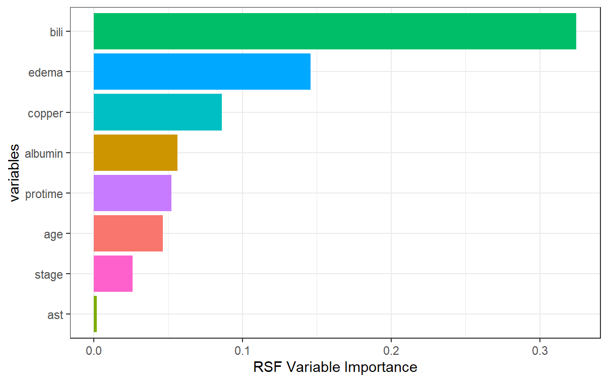
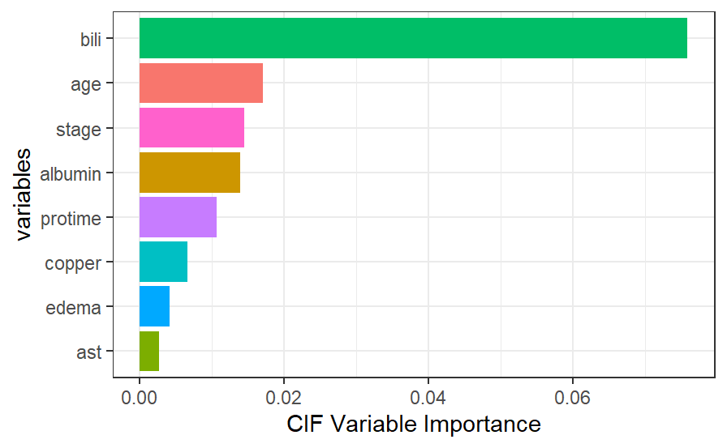
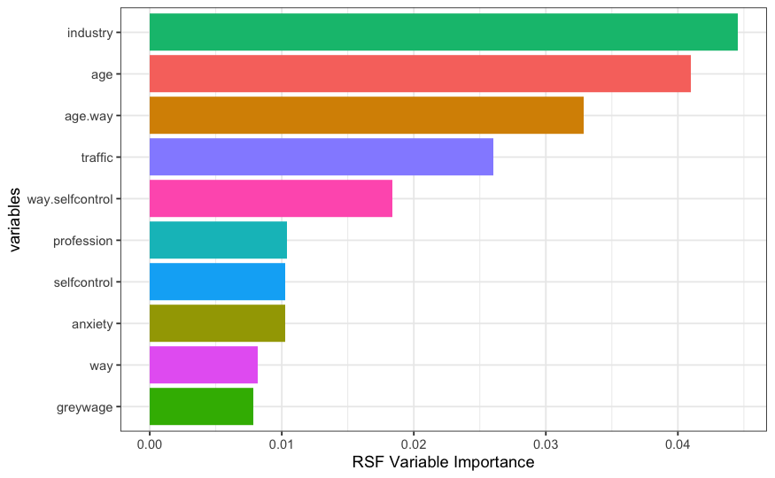
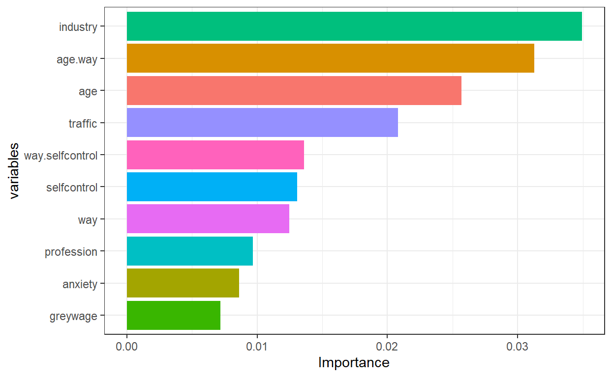

```{r setup, include=FALSE}
knitr::opts_chunk$set(echo = FALSE)
knitr::opts_chunk$set(warning = FALSE)
knitr::opts_chunk$set(message = FALSE)
library(tidyverse)
library(lubridate)
library(kableExtra)
library(janitor)
library(reshape2)
library(data.table)
library(ggplot2)
library(ggthemes)
library(gganimate)
library(gifski)
library(survival)
library(randomForestSRC)
library(readr)
library(tidyverse)
library(tidyr)
library(survminer)
library(party)
library(pec)
library(caret)
library(Metrics)
library(partykit)
library(riskRegression)
library(ggfortify)
library(ranger)
library(imbalance)
library(randomForest)
```

# Predicting Survival and Controlling for Bias with Random Survival Forests and Conditional Inference Forests

## What is Survival Analysis?

The main goal of survival analysis is to analyze and estimate the expected amount of time until an event of interest occurs for a subject or groups of subjects. Originally, survival analysis was developed for the primary use of measuring the lifespans of certain populations[^1]. However, over time its utilities have extended to a wide array of applications even outside of the domain of healthcare. Thus, while biological death continues to be the main outcome under the scrutiny of survival analysis, other outcomes of interest may include time to mechanical failure, time to repeat offense of a released inmate, time to the split of a financial stock and more! Time in survival analysis is relative and all subjects of interest are likened to a common starting point at baseline (t = 0) with a 100% probability of not experiencing the event of interest[^2].

[^1]: Goel, M. K., Khanna, P., & Kishore, J. (2010). Understanding survival analysis: Kaplan-Meier estimate. *International journal of Ayurveda research*, *1*(4), 274.

[^2]: Goel, M. K., Khanna, P., & Kishore, J. (2010). Understanding survival analysis: Kaplan-Meier estimate. *International journal of Ayurveda research*, *1*(4), 274.

Subjects are observed from baseline to some often pre-specified time at the end of study. Thus, not every subject will experience the event of interest within the observational period's time frame. In this case, we don't know if or when these subjects will experience the event, we just know that they have not experienced it during the study period. This is called **censoring**, more specifically, right-censoring[^3]. Right censoring is just one of multiple forms of censoring that survival data strives to adjust for and the form that we will focus on in this comprehensive review. Dropout is also a form of right censoring. The event of interest can happen during the specified time frame, outside of the time frame, or not at all but we don't know which scenario applies to the individuals that leave the study early.

[^3]: Prinja, S., Gupta, N., & Verma, R. (2010). Censoring in clinical trials: review of survival analysis techniques. *Indian journal of community medicine: official publication of Indian Association of Preventive & Social Medicine*, *35*(2), 217.

{width="592"}

It's imperative that we still consider these censored observations in our study instead of removing them so that we don't bias our results towards only those individuals that experienced the event of interest within the observational time frame. Thus, in survival analysis, not only do we include time from baseline at event of interest, but we also include a binary variable indicating whether an individual experienced the event or was censored instead.

In standard survival analysis, the **survival function**, S(t) is what defines the probability that the event of interest has **not** yet happened at time = t.[^4]

[^4]: Kleinbaum, D. G., & Klein, M. (2012). *Survival analysis: a self-learning text* (Vol. 3). New York: Springer.

::: {align="center"}

:::

```{r}

# <div align="center"> t)"></div>

```

S(t) is non-increasing and ranges between 0 and 1. The **hazard function** on the other hand is defined as the instantaneous risk of an individual experiencing the event of interest within a small time frame[^5].

[^5]: Kleinbaum, D. G., & Klein, M. (2012). *Survival analysis: a self-learning text* (Vol. 3). New York: Springer.

::: {align="center"}

:::

```{r}

## <div align="center"> t)}{\delta t}"></div>

```

Both survival functions and hazard functions are alternatives to probability density functions and are better suited for survival data.

Survival regression involves not only information about censorship and time to event, but also additional predictor variables of interest like the sex, age, race, etc. of an individual. The Cox proportional hazards model is a popular and widely utilized modeling technique for survival data because it considers the effects of covariates on the outcome of interest as well as examines the relationships between these variables and the survival distribution[^6]. While this model is praised for its flexibility and simplicity, it is also often criticized for its restrictive proportional hazards assumption.

[^6]: Kleinbaum, D. G., & Klein, M. (2012). The Cox proportional hazards model and its characteristics. In *Survival analysis* (pp. 97-159). Springer, New York, NY.

**The Proportional Hazards Assumption**

The **proportional hazards assumption** states that the relative hazard remains constant over time across the different strata/covariate levels in the data[^7]. The most popular graphical technique for evaluating the PH assumption involves comparing estimated **log-log survival curves** over different strata of the variables being investigated[^8]. A log-log survival curve is a transformation of an estimated survival curve that results from taking the natural log of an estimated survival probability twice. Generally, if the log-log survival curves are approximately parallel for each level of the covariates then the proportional hazard assumption is met.

[^7]: Kleinbaum, D. G., & Klein, M. (2012). The Cox proportional hazards model and its characteristics. In *Survival analysis* (pp. 97-159). Springer, New York, NY.

[^8]: Sestelo, M. (2017). A short course on Survival Analysis applied to the Financial Industry.

{width="608"}

In the case of continuous covariates, this assumption can also be checked using statistical tests and graphical methods based on the scaled **Schoenfeld residuals**[^9]. The Schoenfeld residuals are calculated for all covariates for each individual experiencing an event at a given time. Those are the *differences* between that individual's covariate values at the event time and the corresponding risk-weighted average of covariate values among all individuals at risk. The Schoenfeld residuals are then scaled inversely with respect to their covariances/variances. We can think of this as down-weighting Schoenfeld residuals whose values are uncertain because of high variance. If the assumption is valid, the Schoenfeld residuals are independent of time. A plot that shows a non-random pattern against time is evidence of violation of the PH assumption. In summary, the proportional hazard assumption is supported by a non-significant relationship between residuals and time, and refuted by a significant relationship.

[^9]: Hess, K. R. (1995). Graphical methods for assessing violations of the proportional hazards assumption in Cox regression. *Statistics in medicine*, *14*(15), 1707-1723.

{width="568"}

This is a strong assumption and is often viewed as impractical as it is more often than not violated. There are a number of extensions that aim to deal with data that violate this assumption, but they often rely on restrictive functions or limit the ability to estimate the effects of covariates on survival. **Random survival forests** provide an attractive non-parametric alternative to these models[^10].

[^10]: Nasejje, J. B., Mwambi, H., Dheda, K., & Lesosky, M. (2017). A comparison of the conditional inference survival forest model to random survival forests based on a simulation study as well as on two applications with time-to-event data. *BMC medical research methodology*, *17*(1), 1-17.

## Review of Random Forests

## Random Survival Forests

Used to analyze time to event survival data.

Used to analyze time to event survival data.

Random survival forests use splitting criterion based on survival time and censoring status. Survival trees are binary trees which recursively split tree nodes so that the dissimilarity between child nodes is maximized. Eventually the dissimilar cases are separated and each node becomes more homogeneous. The predictive outcome is defined as the total number of deaths, which is derived from the ensemble cumulative hazard function (CHF).

The algorithm:

1.  Draw $B$ bootstrap samples from the data

2.  Grow a survival tree for each bootstrap sample. For each node of the tree, consider $p$ random variables to split on. The node is split with the candidate variable which maximizes the survival difference between child nodes.

3.  Grow the tree as long to full size and stop when the terminal node has no less than $d_0 > 0$ unique deaths.

4.  Average over $B$ survival trees to obtain the ensemble CHF.

5.  Calculate the prediction error for the ensemble CHF using OOB error.

We determine a terminal node $h\in T$ when there are no less than $d_0 > 0$ unique deaths. Let us define $d_{l,h}$ and $Y_{l,h}$ as the number of deaths and individuals who are at risk at time $t_{l,h}$. Then the CHF estimate for a terminal node $h$ is defined as

$$
\hat{H}_h(t) = \sum_{t_{l,h} \le t} \frac{d_{l,h}}{Y_{l,h}}
$$

Each individual $i$ has a $d$ dimensional covariate $\mathbf{x}_i$. The binary structure of survival trees allows $\mathbf{x}_i$ to be classified into a unique terminal node $h$. Thus the CHF for individual $i$ is

$$
H (t | \mathbf{x}_i) = \hat H_h(t), \ \text{ if } \mathbf{x}_i\in h.
$$

The ensemble CHF is found by averaging over  survival trees.

## Conditional Inference Forests

While random survival forests

## Applications

We will run a random survival forest model and a conditional inference forest model on two real survival datasets.

1.  [PBC Data]{.underline}

The first dataset, the PBC dataset hails from the `survival` package in R and summarizes the survival data of primary biliary cirrhosis (PBC) patients from a randomized trial conducted between 1974 and 1984[^11].

[^11]: Therneau, T. M. (2020). *A Package for Survival Analysis in R*. <https://CRAN.R-project.org/package=survival>

Most of the covariates in the PBC data are either continuous or have two levels (few split-points).

2.  [Employee Data]{.underline}

The second dataset was found on Kaggle, an online community platform for data scientists and machine learning enthusiasts allowing for the public-use of a vast array of practical datasets. This dataset contains the employee attrition information of 1,129 employees.

Unlike the PBC dataset, this data consists of many categorical variables with most of them having more than two-levels (many split-points).

**Model Tuning**

In the case of the random survival forest model, we will tune for two parameter values, number of variables to possibly split at each node (mtry) and minimum size of terminal node (nodesize). We will choose the combination on each data set that yields the lowest out-of-bag error.

**Evaluating the Models: Variable Importance**

For each model, we will assess the ranked **variable importance**. We'll do this using the `varImp` function from the `caret` package in R[^12]. This function tracks the changes in metric statistics for each predictor and accumulates the reduction in the statistic when each predictor's feature is added to the model. The reduction is the measure of variable importance. For trees/forests, the prediction accuracy on the out of bag sample is recorded. The same is done after permuting each predictor variable. The difference between the two accuracies are averaged over all trees, and normalized by the standard error. We'll aim to compare how each of the two models rank the importance of the different covariates.

[^12]: Kuhn, M. (2008). Building Predictive Models in R Using the caret Package. Journal of Statistical Software, 28(5), 1 - 26. doi:<http://dx.doi.org/10.18637/jss.v028.i05>

**Evaluating the Models: Brier Scores**

In certain applications, it is of interest to compare the predictive accuracy of different survival regression strategies for building a risk prediction model. There are several metrics that can be used to assess the resulting probabilistic risk predictions. We're going to focus on one of the most popular metrics, the **Brier score**[^13]. The brier score for an individual is defined as the squared difference between observed survival status (1 = alive at time t and 0 = dead at time t) and a model based prediction of surviving up to time t. The survival status at time t will be right censored for some data. For time to event outcome, this measure can be estimated point-wise over time. We will concentrate on comparing the performance of our models using **prediction error curves** that are obtained by combining time-dependent estimates of the population average Brier score.

[^13]: Nasejje, J. B., Mwambi, H., Dheda, K., & Lesosky, M. (2017). A comparison of the conditional inference survival forest model to random survival forests based on a simulation study as well as on two applications with time-to-event data. *BMC medical research methodology*, *17*(1), 1-17.

Using a test sample of size  , Brier scores at time t are defined as:


```{r}
#BS(t) = \frac{1}{N_{test}}\sum_{l=1}^{N_{test}} \{[0 - \hat{S}(t|x)]^2 \frac{I(t_l \le t, \delta_l = 1)}{\hat{G}(t_l|x)} + [1 - \hat{S}(t|x)]^2 \frac{I(t_l > t)}{\hat{G}(t|x)} \}
```

where  P(C \> t \| X = x) is the Kaplan-Meier estimate of the conditional survival function of the censoring times.

The integrated Brier scores are given by:

::: {align="center"}

:::

To avoid the problem of overfitting that arises from using the same data to train and test the model, we used the Bootstrap cross-validated estimates of the integrated Brier scores. The prediction errors are evaluated in each bootstrap sample.

The prediction errors for each of our models will be implemented in the `pec` package in R[^14]. We implement bootstrap cross-validation to get our estimates for the integrated brier scores. The models are assessed on the data samples that are NOT in the bootstrap sample (OOB data).

[^14]: Mogensen UB, Ishwaran H, Gerds TA (2012). "Evaluating Random Forests for Survival Analysis Using Prediction Error Curves." *Journal of Statistical Software*, **50**(11), 1--23. <https://www.jstatsoft.org/v50/i11>.

### PBC Data

The following description comes from the `survival` package in R[^15]:

[^15]: Therneau, T. M. (2020). *A Package for Survival Analysis in R*. <https://CRAN.R-project.org/package=survival>

Primary sclerosing cholangitis is an autoimmune disease leading to destruction of the small bile ducts in the liver. Progression is slow but inexorable, eventually leading to cirrhosis and liver decompensation.

This data is from the Mayo Clinic trial in PBC conducted between 1974 and 1984. A total of 424 PBC patients met eligibility criteria for the randomized placebo controlled trial of the drug D-penicillamine. This dataset tracks survival status until end up follow up period as well as contains many covariates collected during the clinical trial.

| Variable | Description                                                                                              |
|--------------------------|----------------------------------------------|
| id       | case number                                                                                              |
| time     | number of days between registration and the earlier of death, transplant, or end of observational period |
| status   | status at endpoint, 0/1/2 for censored, transplant, dead                                                 |
| trt      | 1/2/NA for D-penicillmain, placebo, not randomized                                                       |
| age      | in years                                                                                                 |
| sex      | m/f                                                                                                      |
| ascites  | presence of ascites                                                                                      |
| hepato   | presence of hepatomegaly or enlarged liver                                                               |
| spiders  | blood vessel malformations in the skin                                                                   |
| edema    | 0 no edema, 0.5 untreated or successfully treated 1 edema despite diuretic therapy                       |
| bili     | serum bilirunbin (mg/dl)                                                                                 |
| chol     | serum cholesterol (mg/dl)                                                                                |
| albumin  | serum albumin (g/dl)                                                                                     |
| copper   | urine copper (ug/day)                                                                                    |
| alk.phos | alkaline phosphotase (U/liter)                                                                           |
| ast      | aspartate aminotransferase, once called SGOT (U/ml)                                                      |
| trig     | triglycerides (mg/dl)                                                                                    |
| platelet | platelet count                                                                                           |
| protime  | standardized blood clotting time                                                                         |
| stage    | histologic stage of disease (needs biopsy)                                                               |

**Variable Selection**

In order to choose the variables that we want to use in our models, we will first run a cox proportional hazards model with all of the possible main effects in our data. We will then go through a backwards elimination process, removing the variables with the highest p-values over a significance level of 0.05 one by one until all of the main effects are statistically significant. Then, we'll test for all two-way interaction terms and perform backwards elimination until all two-interactions left in the model are statistically significant.

Note that the status variable will be simplified to two levels. Individuals will have a value of 1 if they experienced death, and 0 otherwise, making **death our event of interest**.

```{r}

pbc_use <- pbc %>%
  mutate(status = as.integer(ifelse(status == 2, 1, 0))) %>%
  select(-id)


pbc_use$trt <- as.factor(pbc_use$trt)

pbc_use$ascites <- as.factor(pbc_use$ascites)

pbc_use$hepato <- as.factor(pbc_use$hepato)

pbc_use$spiders <- as.factor(pbc_use$spiders)

pbc_use$copper <- as.numeric(pbc_use$copper)

pbc_use$stage <- as.numeric(pbc_use$stage)

pbc_use$platelet <- as.numeric(pbc_use$platelet)

pbc_use$trig <- as.numeric(pbc_use$trig)

pbc_use$time <- as.numeric(pbc_use$time)

pbc_use$chol <- as.numeric(pbc_use$chol)

```

```{r, echo = TRUE, eval = FALSE}

# test main effects
pbc.main <- coxph(Surv(time, status) ~ ., data =  pbc_use)
step(pbc.main, direction = "backward")

```

```{r}


pbc.cox2 <- coxph(Surv(time, status) ~ . - alk.phos, data = pbc_use)
pbc.cox3 <- coxph(Surv(time, status) ~ . - alk.phos -
                    hepato, data = pbc_use)
pbc.cox4 <- coxph(Surv(time, status) ~ . - alk.phos -
                    hepato - ascites, data = pbc_use)
pbc.cox5 <- coxph(Surv(time, status) ~ . - alk.phos -
                    hepato - ascites - spiders, data = pbc_use)
pbc.cox6 <- coxph(Surv(time, status) ~ . - alk.phos -
                    hepato - ascites - spiders -
                    trt, data = pbc_use)
pbc.cox7 <- coxph(Surv(time, status) ~ . - alk.phos -
                    hepato - ascites - spiders -
                    trt - trig, data = pbc_use)
pbc.cox8 <- coxph(Surv(time, status) ~ . - alk.phos -
                    hepato - ascites - spiders -
                    trt - trig - platelet, data = pbc_use)
pbc.cox9 <- coxph(Surv(time, status) ~ . - alk.phos -
                    hepato - ascites - spiders -
                    trt - trig - platelet - sex, data = pbc_use)
pbc.cox10 <- coxph(Surv(time, status) ~ . - alk.phos -
                    hepato - ascites - spiders -
                    trt - trig - platelet - sex -
                     chol, data = pbc_use)
pbc_use <- pbc_use %>%
  select(-c(alk.phos, hepato, ascites, spiders,
                    trt, trig, platelet, sex, chol))


```

```{r, results='hide', echo = TRUE}

# test two-way interactions
pbc.full <- coxph(Surv(time, status) ~ (.)^2, data =  pbc_use)
#step(pbc.full, direction = "backward")

```

Going through backwards elimination leaves us with a model with age, edema status (edema), serum bilirunbin (bili), serum albumin (albumin), urine copper (copper), aspartate aminotransferase (ast), standardized blood clotting time (protime), histologic stage of disease (stage) and the interactions between age and edema status, age and urine copper, and serum bilirunbin and aspartate aminotransferase.

Note that due to the nature of this dataset, some of the subgroups have not yet reached 50% survival as far as the scope of the information that we have goes. Thus, some survival times were not able to be implemented by our methods due to 'missingness'. To make up for this shortage, we utilized an oversampling technique to bootstrap sample for more observations which also ended up sampling for more censored observations in our data.

```{r}


aareg_pbc <- aareg(Surv(time, status) ~ age + edema + bili + albumin + 
  copper + ast + protime + stage + age:edema + age:copper + 
  bili:ast, 
  data = pbc_use)

pbc_use <- pbc_use %>%
  filter(time %in% aareg_pbc$times)


pbc_use <- imbalance::oversample(na.omit(pbc_use),
           classAttr = "status",
           ratio = 1) %>%
  mutate(status = as.integer(as.character(status)))


 
```

```{r, echo = TRUE}

pbc_cox <- coxph(Surv(time, status) ~ age + edema + bili + albumin + 
  copper + ast + protime + stage + age:edema + age:copper + 
  bili:ast, 
  data = pbc_use)

```

We can test the proportional-hazards assumption using the `cox.zph` function.

For each covariate, the function correlates the corresponding set of scaled Schoenfeld residuals with time to test for independence between residuals and time. Additionally, it performs a global test for the model as a whole.

```{r, echo = TRUE}

test.ph <- cox.zph(pbc_cox)
test.ph

```

```{r}

schoenplot1 <- ggcoxzph(test.ph)[1]
schoenplot2 <- ggcoxzph(test.ph)[3]
schoenplot3 <- ggcoxzph(test.ph)[7]
schoenplot4 <- ggcoxzph(test.ph)[8]
schoenplot5 <- ggcoxzph(test.ph)[11]

schoenplot1$`1`
schoenplot2$`3`
schoenplot3$`7`
schoenplot4$`8`
schoenplot5$`11`


```

The output from the test tells us that the test is statistically significant for age, bili, protime, stage, and the interaction between bili and ast at a significance level of 0.05. It's also globally statistically significant with a p-value of 2e-09. Thus, the PH assumption is violated.

Using random survival forests and conditional inference forests are useful alternatives in this case.

**Random Survival Forest Implementation**

In hyperparameter tuning which was done using the `tune` function from the `e1071` package in R, we found that an mtry value of 1 and a nodesize of 5 produced the lowest out-of-bag error (0.107)[^16].

[^16]: Meyer D, Dimitriadou E, Hornik K, Weingessel A, Leisch F

    (2021). \_e1071: Misc Functions of the Department of

    Statistics, Probability Theory Group (Formerly: E1071), TU

    Wien\_. R package version 1.7-9,

    <https://CRAN.R-project.org/package=e1071>.

```{r, results='hide'}

set.seed(1)
# We can find the optimal mtry and nodesize using OOB
tuning <- tune(formula = Surv(time, status) ~ age + edema + bili + albumin + copper +
       ast + protime + stage + age:edema + age:copper + bili:ast, 
     data = pbc_use,
     mtryStart = ncol(pbc_use) / 2,
     nodesizeTry = c(c(1:9), seq(10, 100, by = 5)),
     ntreeTry =500,
     doBest = TRUE)

res <- as.data.frame(tuning$results)
# print optimal nodesize and mtry
tuning$optimal # wtf lmao
node_size <- c(seq(5, 100, by = 5))

```

```{r parampbc, fig.cap="PBC OOB Error on Parameter Values"}

ggplot(res) +
  geom_line(aes(x = nodesize, y = err, colour = factor(mtry))) +
  labs(col = "mtry")


```

```{r, echo = TRUE}
set.seed(1)
# random forest
pbc_rf <- rfsrc(Surv(time, status) ~ age + edema + bili + albumin + 
  copper + ast + protime + stage + age:edema + age:copper + 
  bili:ast, 
  mtry = 1,
  nodesize = 5,
  data = pbc_use)

```

**Conditional Inference Forest Implementation**

```{r, echo = TRUE}

set.seed(1)
# run conditional inference forest

pbc_cif <- pecCforest(Surv(time, status) ~ age + edema + bili + albumin + 
  copper + ast + protime + stage + age:edema + age:copper + 
  bili:ast,
  data = pbc_use)


```

**Comparing the Models**

We can plot the predicted survival curves for 4 random individuals in our data (2 censored and 2 non-censored) and compare the predicted median survival times (the time where the probability of survival = 0.5) of both of the models to what is observed.

```{r}

set.seed(1)
rand_inds_pbc_event <- sample(nrow(pbc_use[pbc_use$status == 1,]), 2)
rand_inds_pbc_cens <- sample(nrow(pbc_use[pbc_use$status == 0,]), 2)
rand_data_pbc <- rbind(pbc_use[pbc_use$status == 1,][rand_inds_pbc_event, ],
                       pbc_use[pbc_use$status == 0,][rand_inds_pbc_cens, ])

cif.predict3_pbc <- treeresponse(pbc_cif$forest, 
                                 newdata = rand_data_pbc)


```

```{r}
set.seed(1)
# Obtain predicted values for RSF
pbc_pred <- predict(pbc_rf, rand_data_pbc)

# obtain time values
Time <- pbc_rf$time.interest


```

```{r, eval =FALSE}


cif.predict3_pbc$`69`
cif.predict3_pbc$`40`
cif.predict3_pbc$`14`
cif.predict3_pbc$`153`


```

```{r, eval=FALSE}


##########
# Finding the Median Survival Probability
# obtain the index for which the survival probability = 0.5
t_id1 <- which.min(abs(round(pbc_pred$survival[1,], 2) -.5))
t_id2 <- which.min(abs(round(pbc_pred$survival[2,], 2) - .5))
t_id3 <- which.min(abs(round(pbc_pred$survival[3,], 2) - .5))
t_id4 <- which.min(abs(round(pbc_pred$survival[4,], 2) - .5))
# obtain the times at which survival probability = 0.5 occurs
Time[t_id1] # 1827
Time[t_id2] # 1487
Time[t_id3] # 3584
Time[t_id4] # 3584

```

```{r}

par(mfrow = c(2,2))
# Compare the two methods by plotting
plot(cif.predict3_pbc$`69`, col = "blue",
     main = "PBC Pred. Survival Individual 69",
     sub = "Event Experienced",
     xlab = "time",
     ylab = "Survival Probability")
lines(Time, pbc_pred$survival[1,], col = "green")
legend(4000, -0.46,          # Position
       legend = c("CIF", "RSF"),  # Legend texts
       title = "Method",           
       col = c("blue", "green"),          
       lwd = 2,
       xpd = "NA",
       cex = 0.8)   

plot(cif.predict3_pbc$`40`, col = "blue",
     main = "PBC Pred. Survival Individual 40",
     sub = "Event Experienced",
     xlab = "time",
     ylab = "Survival Probability")
lines(Time, pbc_pred$survival[2,], col = "green")
  

plot(cif.predict3_pbc$`14`, col = "blue",
     main = "PBC Pred. Survival Individual 140",
     sub = "Censored",
     xlab = "time",
     ylab = "Survival Probability")
lines(Time, pbc_pred$survival[3,], col = "green")
  

plot(cif.predict3_pbc$`153`, col = "blue",
     main = "PBC Pred. Survival Individual 153",
     sub = "Censored",
     xlab = "time",
     ylab = "Survival Probability")
lines(Time, pbc_pred$survival[3,], col = "green")


```

| id  | time | event | RSF median survival | CIF median survival |
|-----|------|-------|---------------------|---------------------|
| 69  | 3395 | 1     | 1827                | 1741                |
| 40  | 1487 | 1     | 1487                | 1536                |
| 140 | 3445 | 0     | 3584                | 3584                |
| 153 | 2224 | 0     | 3584                | 3584                |

For the observations that experienced death, the random forest model predicts a median survival time closer to time of death than the random survival forest model does. For the censored individuals #140 and #153, both models predict the same median survival times for both observations.

[Variable Importance]{.underline}

```{r, eval = FALSE}
## VAR IMP CIF ##
pbc_cif_var <- party::cforest(Surv(time, status) ~ age + edema + bili + albumin + 
  copper + ast + protime + stage + age:edema + age:copper + 
  bili:ast,
  data = pbc_use)


pbc.var_imp_cif <- data.frame(importance = varImp(pbc_cif_var)) %>%
  arrange(desc(Overall))


pbc.var_imp_cif$vars <- rownames(pbc.var_imp_cif)

ggplot(pbc.var_imp_cif, aes(x = reorder(vars, -Overall, decreasing = TRUE), 
                        y = Overall, 
                        fill = vars)) +
  geom_col() +
  coord_flip() +
  labs(x = "variables", 
       y = "CIF Variable Importance") + theme_bw() +
  theme(legend.position = "none")


```





```{r pbcvarimprsf, eval=FALSE}

## VAR IMP RSF ##
rf_imp_pbc <- data.frame(importance = vimp(pbc_rf)$importance %>% sort(decreasing = T))
rf_imp_pbc$variables <- rownames(rf_imp_pbc)

ggplot(rf_imp_pbc, aes(x = reorder(variables, -importance, decreasing = TRUE), 
                        y = importance, 
                        fill = variables)) +
  geom_col() +
  coord_flip() +
  labs(x = "variables",
       y = "RSF Variable Importance") + theme_bw() +
  theme(legend.position = "none")

#plot.survival.rfsrc(pbc_rf)


```





We can compare the variable importance rankings between the random survival forest and the conditional inference forest. Most notably, the scale of variable importance is larger in the conditional inference forest case than it is in the random survival forest. This is because even though bili is the most important predictor in both models, it is that much more important in the conditional inference forest. Additionally, we see that while edema and copper are 2nd and 3rd most important in the random survival forest, they are relatively not that important in the conditional inference forest. Conversely, while age and stage are important in the conditional inference forest, they are not as important in the random survival forest. One thing to note is that the variable edema can be viewed as a predictor with many split-points (greater than 2), taking on three unique values: 0, 0.5, and 1. We may be seeing the inherent bias problem coming into play here in the fact that the random survival forest favors that variable in terms of its importance.

[Prediction Error Curves]{.underline}

We can compare the prediction error curves for the random survival forest and the conditional inference forest models.

Using bootstrap cross-validation (  = 50), we see an integrated brier score of 0.07 for the random survival forest and 0.073 for the conditional inference forest. Recall that a lower score means better performance. While the random survival forest performs better here, we see that the difference is marginal and perhaps negligible.

```{r}
set.seed(1)
fit_comp_pbc <- pec(list("rsf" = pbc_rf, "cforest" = pbc_cif),  
                    data = pbc_use,
                    formula = Surv(time, status) ~ age + edema + bili + albumin + copper + ast + protime + stage + age:edema + age:copper + bili:ast,  
                    splitMethod = "BootCv",
                    reference = FALSE,
                    maxtime = 3445,
                    B = 50,
                    exact = TRUE
              )

```

```{r}

crps(fit_comp_pbc)


plot(fit_comp_pbc, predErr = "BootCvErr")

```

### Employee Turnover Data

A dataset found on Kaggle containing the employee attrition information of 1,129 employees and information about time to turnover, their gender, age, industry, profession, employee pipeline information, the presence of a coach on probation, the gender of their supervisor, and wage information.

```{r, results='hide'}

turnover <- read_csv("data/turnover.csv")

```

| Variable     | Description                                                                                                                                                                                                                                                                                                                                                                                                                                                                                                                                                                                                                                                                |
|--------------------------|----------------------------------------------|
| stag         | Experience (time)                                                                                                                                                                                                                                                                                                                                                                                                                                                                                                                                                                                                                                                          |
| event        | Employee turnover                                                                                                                                                                                                                                                                                                                                                                                                                                                                                                                                                                                                                                                          |
| gender       | Employee's gender, female (f), or male (m)                                                                                                                                                                                                                                                                                                                                                                                                                                                                                                                                                                                                                                 |
| age          | Employee's age (year)                                                                                                                                                                                                                                                                                                                                                                                                                                                                                                                                                                                                                                                      |
| industry     | Employee's Industry                                                                                                                                                                                                                                                                                                                                                                                                                                                                                                                                                                                                                                                        |
| profession   | Employee's profession                                                                                                                                                                                                                                                                                                                                                                                                                                                                                                                                                                                                                                                      |
| traffic      | From what pipeline employee came to the company. 1. contacted the company directly (advert). 2. contacted the company directly on the recommendation of a friend that's not an employee of the company (recNErab). 3. contacted the company directly on the recommendation of a friend that IS an employee of the company (referral). 4. applied for a vacancy on the job site (youjs) 5. recruiting agency brought you to the employer (KA) 6. invited by an employer known before employment (friends). 7. employer contacted on the recommendation of a person who knows the employee (rabrecNErab). 8. employer reached you through your resume on the job site (empjs). |
| coach        | presence of a coach (training) on probation                                                                                                                                                                                                                                                                                                                                                                                                                                                                                                                                                                                                                                |
| head_gender  | head (supervisor) gender (m/f)                                                                                                                                                                                                                                                                                                                                                                                                                                                                                                                                                                                                                                             |
| greywage     | The salary does not seem to the tax authorities. Greywage in Russia or Ukraine means that the employer (company) pay just a tiny bit amount of salary above the white-wage (white-wage means minimum wage) (white/gray)                                                                                                                                                                                                                                                                                                                                                                                                                                                    |
| way          | Employee's way of transportation (bus/car/foot)                                                                                                                                                                                                                                                                                                                                                                                                                                                                                                                                                                                                                            |
| extraversion | Extraversion score                                                                                                                                                                                                                                                                                                                                                                                                                                                                                                                                                                                                                                                         |
| independ     | Independend score                                                                                                                                                                                                                                                                                                                                                                                                                                                                                                                                                                                                                                                          |
| selfcontrol  | Self-control score                                                                                                                                                                                                                                                                                                                                                                                                                                                                                                                                                                                                                                                         |
| anxiety      | Anxiety Score                                                                                                                                                                                                                                                                                                                                                                                                                                                                                                                                                                                                                                                              |
| novator      | Novator Score                                                                                                                                                                                                                                                                                                                                                                                                                                                                                                                                                                                                                                                              |

**Variable Selection**

We'll follow the same variable selection procedure that we did for the PBC data.

```{r}
turn_use <- turnover
turn_use$event = as.integer(turn_use$event)
turn_use$gender = as.factor(turn_use$gender)
turn_use$industry = as.factor(turn_use$industry)
turn_use$profession = as.factor(turn_use$profession)
turn_use$traffic = as.factor(turn_use$traffic)
turn_use$coach = as.factor(turn_use$coach)
turn_use$head_gender = as.factor(turn_use$head_gender)
turn_use$greywage = as.factor(turn_use$greywage)
turn_use$way = as.factor(turn_use$way)
```

```{r, echo = TRUE, eval = FALSE}

# test main effects
turn.main <- coxph(Surv(stag, event) ~ ., data =  turn_use)
step(turn.main, direction = "backward")

```

```{r}

turn_use <- turn_use %>%
  select(c(stag, event, age, industry, profession, traffic, greywage, way, selfcontrol, anxiety))

```

```{r, results='hide', eval = FALSE, echo = TRUE}

# test two-way interactions
turn.full <- coxph(Surv(stag, event) ~ (.)^2, data =  turn_use)
step(turn.full, direction = "backward")

```

Going through backwards elimination leaves us with a model with age, employee's industry (industry), employee's profession (profession), employee's pipeline origin (traffic), wage standard (greywage), employee's way of transportation (way), self-control score (selfcontrol), anxiety score (anxiety), and the interactions between age and way of transportation and way of transportation and self-control score.

```{r, echo = TRUE}

turn_cox <- coxph(Surv(stag, event) ~ age + industry + profession + traffic + 
        greywage + way + selfcontrol + anxiety + age:way + way:selfcontrol,
       data =  turn_use)

```

We can test the proportional-hazards assumption for this model using the `cox.zph` function.

```{r, echo = TRUE}

test.ph_turn <- cox.zph(turn_cox)
test.ph_turn

```

```{r}

schoenplot1_turn <- ggcoxzph(test.ph_turn)[3]

schoenplot1_turn$`3`


```

The output from the test tells us that the test is statistically significant for profession at a significance level of 0.05. It's also globally statistically significant with a p-value of 0.007. Thus, the PH assumption is violated and random survival forests and conditional inference forests can be useful alternatives with this data as well.

**Random Survival Forest Implementation**

Note that to run random survival forest for the employee turnover data, due to computational issues, we've switched to using the `ranger` function from the `ranger` package in R. We'll run a parameter tuned random survival forest model with the variables and interactions that we identified in variable selection.

```{r}

turn_use$age.way <- interaction(turn_use$age, turn_use$way)
turn_use$way.selfcontrol <- interaction(turn_use$way,
                                        turn_use$selfcontrol)

```

```{r, echo=TRUE}

set.seed(1)
# random survival forest
turn_rsf <- ranger(Surv(stag, event) ~ age + industry + profession + traffic + 
        greywage + way + selfcontrol + anxiety +
          age.way + way.selfcontrol,
       data =  turn_use)


```

**Conditional Inference Forest Implementation**

We'll run a conditional inference forest model next with the variables and interactions that we identified in variable selection.

```{r, echo=TRUE}

set.seed(1)
turn_cif <- pecCforest(Surv(stag, event) ~ age + industry + profession + traffic + 
        greywage + way + selfcontrol + anxiety +
          age.way + way.selfcontrol,
       data =  turn_use)


```

**Comparing the Models**

Similar to the PBC data, we will choose 4 random individuals in the study, 2 who experienced the event of interest and 2 who are censored, and plot and compare their predicted survival curves as well as their predicted median survival times ( the time where the probability of survival = 0.5) to what is observed.

```{r}

set.seed(1)
rand_inds_turn_event <- sample(nrow(turn_use[turn_use$event == 1,]), 2)
rand_inds_turn_cens <- sample(nrow(turn_use[turn_use$event == 0,]), 2)
rand_data_turn <- rbind(turn_use[turn_use$event == 1,][rand_inds_turn_event, ],
                       turn_use[turn_use$event == 0,][rand_inds_turn_cens, ])

cif.predict3_turn <- treeresponse(turn_cif$forest, 
                                 newdata = rand_data_turn)

turn_rsf_pred <- predict(turn_rsf, rand_data_turn, type='response')
time <- turn_rsf_pred$unique.death.times
```

```{r, eval =FALSE}

cif.predict3_turn$`1`
cif.predict3_turn$`2`
cif.predict3_turn$`3`
cif.predict3_turn$`4`


#fit <- survfit(Surv(stag, event) ~ age + industry + profession + traffic + 
 #       greywage + way + selfcontrol + anxiety, 
#        data = turn_use)

# find median survival
t1 <- max(which(abs(turn_rsf_pred$survival[1,] -.5) == min(abs(turn_rsf_pred$survival[1,] -.5))))
t2 <- max(which(abs(turn_rsf_pred$survival[2,] -.5) == min(abs(turn_rsf_pred$survival[2,] -.5))))
t3 <- max(which(abs(turn_rsf_pred$survival[3,] -.5) == min(abs(turn_rsf_pred$survival[3,] -.5))))
t4 <- max(which(abs(turn_rsf_pred$survival[4,] -.5) == min(abs(turn_rsf_pred$survival[4,] -.5))))

time[c(t1, t2, t3, t4)] #  49.34702  74.05339 164.56674 179.44969
```

```{r}

par(mfrow = c(2,2))
# Compare the two methods by plotting
plot(cif.predict3_turn$`1`, col = "blue",
     main = "Turn Pred. Survival Individual 129",
     sub = "Event Experienced",
     xlab = "time",
     ylab = "Survival Probability")
lines(time, turn_rsf_pred$survival[1,], col = "green")
legend(180, -0.46,          # Position
  legend = c("CIF", "RSF"),  # Legend texts
    title = "Method",
      col = c("blue", "green"),
      lwd = 2,
      xpd = "NA",
      cex = 0.8)

plot(cif.predict3_turn$`2`, col = "blue",
     main = "Turn Pred. Survival Individual 509",
     sub = "Event Experienced",
     xlab = "time",
     ylab = "Survival Probability")
lines(time, turn_rsf_pred$survival[2,], col = "green")
  

plot(cif.predict3_turn$`3`, col = "blue",
     main = "PBC Pred. Survival Individual 471",
     sub = "Censored",
     xlab = "time",
     ylab = "Survival Probability")
lines(time, turn_rsf_pred$survival[3,], col = "green")
  

plot(cif.predict3_turn$`4`, col = "blue",
     main = "PBC Pred. Survival Individual 299",
     sub = "Censored",
     xlab = "time",
     ylab = "Survival Probability")
lines(time, turn_rsf_pred$survival[4,], col = "green")


```

| id  | time  | event | RSF median survival | CIF median survival |
|-----|-------|-------|---------------------|---------------------|
| 129 | 49.38 | 1     | 49.3                | 21.6                |
| 509 | 73.3  | 1     | 74.1                | 73.3                |
| 471 | 14.49 | 0     | 164.6               | 80.2                |
| 299 | 73.43 | 0     | 179.4               | 133.0               |

We see that....

[Variable Importance]{.underline}

First, we'll compare the variables that the random survival forest model and the conditional inference model found to be most important in the training process on the employee turnover data.

```{r, eval=FALSE}

set.seed(1)
turn_cif_var <- party::cforest(Surv(stag, event) ~ age + industry + profession + traffic + 
        greywage + way + selfcontrol + anxiety + 
          age.way + way.selfcontrol,
       data =  turn_use)


turn.var_imp_cif <- data.frame(importance = varImp(turn_cif_var)) %>%
  arrange(desc(Overall))


turn.var_imp_cif$vars <- rownames(turn.var_imp_cif)

ggplot(turn.var_imp_cif, aes(x = reorder(vars, -Overall, decreasing = TRUE), 
                        y = Overall, 
                        fill = vars)) +
  geom_col() +
  coord_flip() +
  labs(x = "variables", 
       y = "Importance") + theme_bw() +
  theme(legend.position = "none")

```

```{r, eval = FALSE}

turn.rf.imp <- ranger(Surv(stag, event) ~ age + industry + profession + traffic + 
        greywage + way + selfcontrol + anxiety +
          age.way + way.selfcontrol,
       data =  turn_use,
       importance = 'permutation')

turn.rf.imp$variable.importance
turn_rf_imp <- data.frame(importance = turn.rf.imp$variable.importance) %>%
  arrange(desc(importance))
turn_rf_imp$vars <- rownames(turn_rf_imp)

ggplot(turn_rf_imp, aes(x = reorder(vars, importance, decreasing = TRUE), 
                        y = importance, 
                        fill = vars)) +
  geom_col() +
  coord_flip() +
  labs(x = "variables", 
       y = "RSF Variable Importance") + theme_bw() +
  theme(legend.position = "none")

```







While the two models generally agree on the first 5 most important variables (with a switch in age and age.way in terms of order), we can focus on the magnitude of the variable importance as well as the ordering of variables 6-9. The industry variable in the dataset is one of the variables that has the most split points/levels. There are 16 unique variables that industry can take. Even though both models rank this variable to be the most important, relative to the conditional inference forest, the random survival forest seems to inflate the importance of this covariate as it reaches an importance of just over 0.04 in the random survival forest (as opposed to about 0.035 in the conditional inference forest). After the first 5 variables, the random survival forest ranks profession, self-control, anxiety, and way as the next important while the conditional inference forest ranks self-control, way, profession, and then anxiety as the next important.

What may be of interest here is the ranking of the profession variable which has 15 unique split points. The random survival forest ranks this variable 2 places higher than the conditional inference forest does. The conditional inference forest on the other hand seems to favor the numeric self-control score over profession which may indicate an attempt to control for bias.


[Prediction Error Curves]{.underline}

We can compare the prediction error curves of the two models. Recall that these estimates are based on the average brier scores computed at different time points. We reduce  = 5 for computation and run-time purposes.

```{r}

predictSurvProb.ranger <- function (object, newdata, times, ...) {
    ptemp <- ranger:::predict.ranger(object, data = newdata, importance = "none")$survival
    pos <- prodlim::sindex(jump.times = object$unique.death.times, 
        eval.times = times)
    p <- cbind(1, ptemp)[, pos + 1, drop = FALSE]
    if (NROW(p) != NROW(newdata) || NCOL(p) != length(times)) 
        stop(paste("\nPrediction matrix has wrong dimensions:\nRequested newdata x times: ", 
            NROW(newdata), " x ", length(times), "\nProvided prediction matrix: ", 
            NROW(p), " x ", NCOL(p), "\n\n", sep = ""))
    p
}

```

```{r, results='hide'}

form <- as.formula(paste("Surv(stag, event)~",
       paste(turn_rsf$forest$independent.variable.names, collapse="+")))

#?pec::predictSurvProb
fit_comp_turn <- pec(list("rsfc" = turn_rsf, "cforest" = turn_cif), 
                     data = turn_use, 
              formula= form,  
              splitMethod = "BootCv",
        B = 5,
        reference = FALSE
              )
```

```{r}

crps(fit_comp_turn)

```

```{r}

plot(fit_comp_turn, predErr = "BootCvErr")

```

## Closing Thoughts


