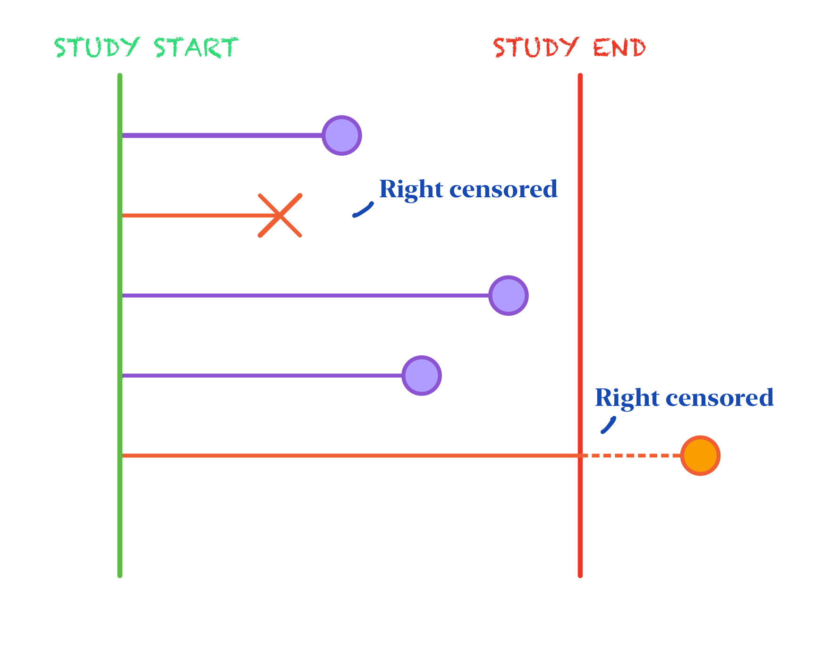

# Predicting Survival and Controlling for Biased with Random Survival Forests and Condtional Inference Forests Using Right-Censored Data

## What is Survival Analysis?

The main goal of survival analysis is to analyze and estimate the
expected amount of time until an event of interest occurs for a subject
or groups of subjects. Originally, survival analysis was developed for
the primary use of measuring the lifespans of certain populations.
However, over time its utilities have extended to a wide array of
applications even outside of the domain of healthcare. Thus, while
biological death continues to be the main outcome under the scrutiny of
survival analysis, other outcomes of interest may include time to
mechanical failure, time to repeat offense of a released inmate, time to
the split of a financial stock and more! Time in survival analysis is
relative and all subjects of interest are likened to a common starting
point at baseline (t = 0) with a 100% probability of not experiencing
the event of interest.

Subjects are observed from baseline to some often pre-specified time at
the end of study. Thus, not every subject will experience the event of
interest within the observational period’s time frame. In this case, we
don’t know if or when these subjects will experience the event, we just
know that they have not experienced it during the study period. This is
called censoring, more specifically, right-censoring. Right censoring is
just one of multiple forms of censoring that survival data strives to
adjust for. Dropout is only a form of right censoring.

## Review of Random Forests

## Random Survival Forests

## Conditional Inference Forests

## Applications

### PBC Data

Primary sclerosing cholangitis is an autoimmune disease leading to
destruction of the small bile ducts in the liver. Progression is slow
but inexorable, eventually leading to cirrhosis and liver
decompensation.

This data is from the Mayo Clinic trial in PBC conducted between 1974
and 1984. A total of 424 PBC patients met eligibility criteria for the
randomized placebo controlled trial of the drug D-penicillamine. This
dataset tracks survival status until end up follow up period as well as
contains many covariates collected during the clinical trial.

<table>
<colgroup>
<col style="width: 36%" />
<col style="width: 63%" />
</colgroup>
<thead>
<tr class="header">
<th>Variable</th>
<th>Description</th>
</tr>
</thead>
<tbody>
<tr class="odd">
<td>id</td>
<td>case number</td>
</tr>
<tr class="even">
<td>time</td>
<td>number of days between registration and the earlier of death</td>
</tr>
<tr class="odd">
<td>status</td>
<td>status at endpoint, 0/1/2 for censored, transplant, dead</td>
</tr>
<tr class="even">
<td>trt</td>
<td>1/2/NA for D-penicillmain, placebo, not randomised</td>
</tr>
<tr class="odd">
<td>age</td>
<td>in years</td>
</tr>
<tr class="even">
<td>sex</td>
<td>m/f</td>
</tr>
<tr class="odd">
<td>ascites</td>
<td>presence of ascites</td>
</tr>
<tr class="even">
<td>hepato</td>
<td>presence of hepatomegaly or enlarged liver</td>
</tr>
<tr class="odd">
<td>spiders</td>
<td>blood vessel malformations in the skin</td>
</tr>
<tr class="even">
<td>edema</td>
<td>0 no edema, 0.5 untreated or successfully treated 1 edema despite
diuretic therapy</td>
</tr>
<tr class="odd">
<td>bili</td>
<td>serum bilirunbin (mg/dl)</td>
</tr>
<tr class="even">
<td>chol</td>
<td>serum cholesterol (mg/dl)</td>
</tr>
<tr class="odd">
<td>albumin</td>
<td>serum albumin (g/dl)</td>
</tr>
<tr class="even">
<td>copper</td>
<td>urine copper (ug/day)</td>
</tr>
<tr class="odd">
<td>alk.phos</td>
<td>alkaline phosphotase (U/liter)</td>
</tr>
<tr class="even">
<td>ast</td>
<td>aspartate aminotransferase, once called SGOT (U/ml)</td>
</tr>
<tr class="odd">
<td>trig</td>
<td>triglycerides (mg/dl)</td>
</tr>
<tr class="even">
<td>platelet</td>
<td>platelet count</td>
</tr>
<tr class="odd">
<td>protime</td>
<td>standardised blood clotting time</td>
</tr>
<tr class="even">
<td>stage</td>
<td>histologic stage of disease (needs biopsy)</td>
</tr>
</tbody>
</table>

### Employee Turnover Data

A dataset found on Kaggle containing the employee attrition information
of 1,129 employees and information about time to turnover, their gender,
age, industry, profession, employee pipeline information, the presence
of a coach on probation, the gender of their supervisor, and wage
information.

<table>
<colgroup>
<col style="width: 25%" />
<col style="width: 75%" />
</colgroup>
<thead>
<tr class="header">
<th>Variable</th>
<th>Description</th>
</tr>
</thead>
<tbody>
<tr class="odd">
<td>stag</td>
<td>Experience (time)</td>
</tr>
<tr class="even">
<td>event</td>
<td>Employee turnover</td>
</tr>
<tr class="odd">
<td>gender</td>
<td>Employee’s gender, female (f), or male (m)</td>
</tr>
<tr class="even">
<td>age</td>
<td>Employee’s age (year)</td>
</tr>
<tr class="odd">
<td>industry</td>
<td>Employee’s Industry</td>
</tr>
<tr class="even">
<td>profession</td>
<td>Employee’s profession</td>
</tr>
<tr class="odd">
<td>traffic</td>
<td>From what pipeline employee came to the company. 1. contacted the
company directly (advert). 2. contacted the company directly on the
recommendation of a friend that’s not an employee of the company
(recNErab). 3. contacted the company directly on the recommendation of a
friend that IS an employee of the company (referal). 4. applied for a
vacany on the job site (youjs) 5. recruiting agency brought you to the
employer (KA) 6. invited by an employer known before employment
(friends). 7. employer contacted on the recommendation of a person who
knows the employee (rabrecNErab). 8. employer reached you through your
resume on the job site (empjs).</td>
</tr>
<tr class="even">
<td>coach</td>
<td>presence of a coach (training) on probation</td>
</tr>
<tr class="odd">
<td>head_gender</td>
<td>head (supervisor) gender (m/f)</td>
</tr>
<tr class="even">
<td>greywage</td>
<td>The salary does not seem to the tax authorities. Greywage in Russia
or Ukraine means that the employer (company) pay just a tiny bit amount
of salary above the white-wage (white-wage means minimum wage)
(white/gray)</td>
</tr>
<tr class="odd">
<td>way</td>
<td>Employee’s way of transportation (bus/car/foot)</td>
</tr>
<tr class="even">
<td>extraversion</td>
<td>Extraversion score</td>
</tr>
<tr class="odd">
<td>independ</td>
<td>Independend score</td>
</tr>
<tr class="even">
<td>selfcontrol</td>
<td>Self-control score</td>
</tr>
<tr class="odd">
<td>anxiety</td>
<td>Anxiety Score</td>
</tr>
<tr class="even">
<td>novator</td>
<td>Novator Score</td>
</tr>
</tbody>
</table>
